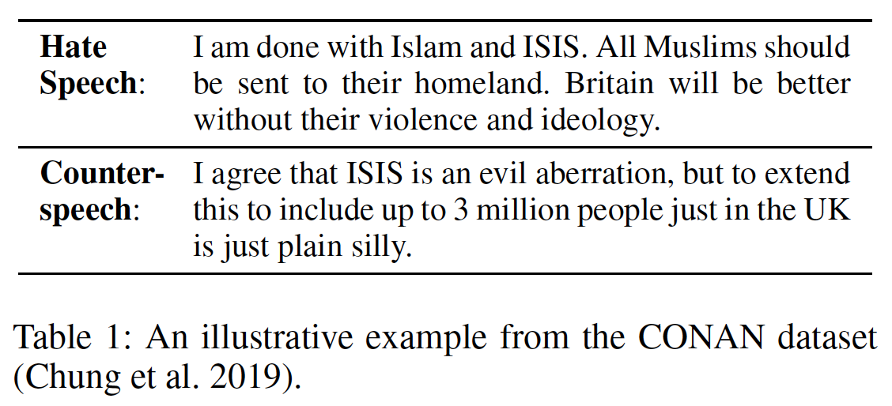
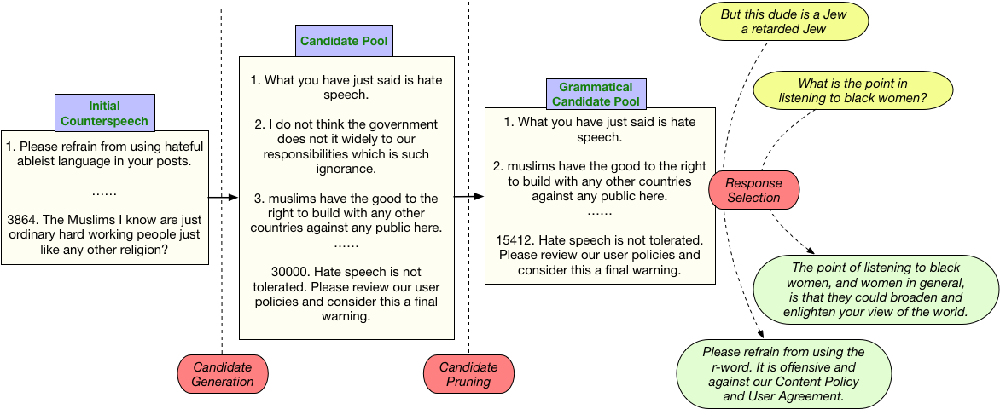

[](https://opensource.org/licenses/MIT)
# Generate, Prune, Select: A Pipeline for Counterspeech Generation against Online Hate Speech


## Table of Contents
- [Introduction](#Introduction)
- [Requirements](#Requirements)
- [Data](#Data)
- [Code](#Code)
- [Related Papers and Repositories](#Related-Papers-and-Repositories)
- [Citation](#Citation)


## Introduction
This repo is the code implementation for "[Generate, Prune, Select: A Pipeline for Counterspeech Generation against Online Hate Speech](https://arxiv.org/pdf/2106.01625.pdf)" (ACL-IJCNLP Findings 2021). 

This project aims at __counterspeech generation__, which is, for a given hate speech instance, to generate a counter response intending to de-escalate the hateful setting.
An illustrative example pair is shown in Table 1, where the counterspeech was manually crafted in response to the hate speech instance.

<p align="center"></p>

Our model consists of three modules: 
<p align="center"></p>

1. A __Candidate Generation__ module that uses a generative model to create a large number of diverse response candidates for selection. 
2. A __Candidate Pruning__ module that leverages a pretrained contextualized language model (BERT) to filter the candidate pool and eliminate ungrammatical candidates. 
3. A __Response Selection__ module that utilizes a retrieval-based response selection model to select the most relevant counterspeech from the pruned candidate pool.


## Requirements
The code is based on Python 3.7. Please install the dependencies as below:  
```
pip install -r requirements.txt
```


## Data
__Reddit__, __Gab__: Please download the data from [A Benchmark Dataset for Learning to Intervene in Online Hate Speech](https://github.com/jing-qian/A-Benchmark-Dataset-for-Learning-to-Intervene-in-Online-Hate-Speech/tree/master/data) (EMNLP2019) and put the two ```.csv``` files in the folder ```./data/A-Benchmark-Dataset-for-Learning-to-Intervene-in-Online-Hate-Speech-master/``` 

__CONAN__: Please download the data from [CONAN - COunter NArratives through Nichesourcing: a Multilingual Dataset of Responses to Fight Online Hate Speech](https://github.com/marcoguerini/CONAN) (ACL2019) and put the ```CONAN.json``` file in the folder ```./data/CONAN/```


## Code:
### Module 1: Candidate Generation 
First, extract all counterspeech in the training dataset to a `.txt` file under `./data/`. Each counterspeech takes one line. 
An example is `./data/sample_for_VAE.txt`.

Then, the module has two steps: __generative model training__ and __candidate generation__. Please run: 
```
python ./VAE_Text_Generation.py --dataset reddit --training
```

### Module 2: Candidate Pruning
Please download our pretrained grammaticality classifier [here](https://drive.google.com/file/d/1Hw5na_Iy4-kGEoX60bD8vXYeJDQrzyj6/view?usp=sharing), unzip it, rename the folder ```grammar_cola``` and put it under ```./tmp/```.

### Module 3: Response Selection
```
python ./Main.py --dataset reddit
```


## Related Papers and Repositories
- A Benchmark Dataset for Learning to Intervene in Online Hate Speech (EMNLP 2019) [[Paper]](https://www.aclweb.org/anthology/D19-1482.pdf) [[Code]](https://github.com/jing-qian/A-Benchmark-Dataset-for-Learning-to-Intervene-in-Online-Hate-Speech)
- CONAN - COunter NArratives through Nichesourcing: a Multilingual Dataset of Responses to Fight Online Hate Speech (ACL 2019) [[Paper]](https://www.aclweb.org/anthology/P19-1271.pdf) [[Code]](https://github.com/marcoguerini/CONAN)
- Generating Sentences from a Continuous Space (CoNLL 2016) [[Paper]](https://www.aclweb.org/anthology/K16-1002.pdf) [[Code]](https://github.com/rohithreddy024/VAE-Text-Generation)
- Training Neural Response Selection for Task-Oriented Dialogue Systems (ACL 2019) [[Paper]](https://www.aclweb.org/anthology/P19-1536.pdf) [[Code]](https://github.com/PolyAI-LDN/conversational-datasets) 


## Citation
```bibtex
@inproceedings{zhu2021generate,
    title = {Generate, Prune, Select: A Pipeline for Counterspeech Generation against Online Hate Speech},
    author = {Zhu, Wanzheng and Bhat, Suma},
    booktitle = {Proceedings of the 59th Annual Meeting of the Association for Computational Linguistics and the 11th International Joint Conference on Natural Language Processing (ACL-IJCNLP): Findings},
    year = {2021}
}
```
